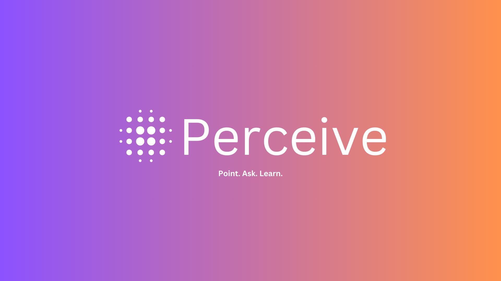
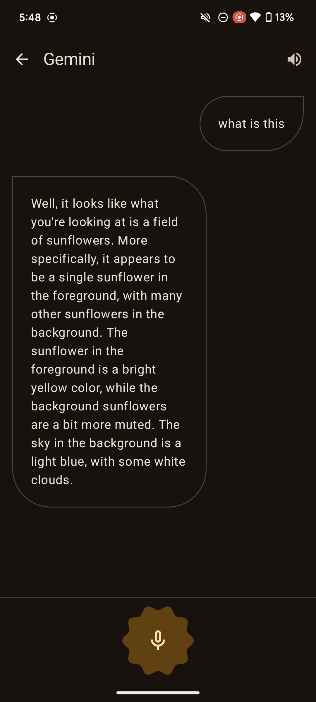

# Perceive - Point. Ask. Learn. - AI insights at your fingertips


Perceive is a fully AI powered Android App that helps you to explore, learn and play like never before! Just point your camera at anything and start a conversation! See something interesting and
want to know more about it? Just point the camera and ask away!

## Table of Contents
1. [Demo](#demo)
2. [Screenshots](#screenshots)
3. [Tech Stack](#tech-stack)
4. [Notable Features](#notable-features)
5. [Source code, Architecture, & Testing](#source-code-architecture--testing)
6. [Building and running the app](#building-and-running-the-app)

## Demo
Coming Soon!

## Screenshots
   

## Tech Stack
- Entirely written in [Kotlin](https://kotlinlang.org/).
- [CameraX](https://developer.android.com/training/camerax) for accessing and processing images captured from the camera.
- [Hilt](https://www.google.com/url?client=internal-element-cse&cx=000521750095050289010:zpcpi1ea4s8&q=https://developer.android.com/training/dependency-injection/hilt-android&sa=U&ved=2ahUKEwiW5omeu6z4AhWRR2wGHVUsCo0QFnoECAMQAQ&usg=AOvVaw3dCbP79C6od3KVCnJub3v0) for dependency injection.
- [Jetpack Compose](https://developer.android.com/jetpack/compose) for UI and navigation.
- [Preferences Datastore](https://developer.android.com/topic/libraries/architecture/datastore) for persistently managing key-value pairs.
- [Kotlin Coroutines](https://kotlinlang.org/docs/reference/coroutines/coroutines-guide.html) for threading.
- [Kotlin Flows](https://developer.android.com/kotlin/flow) for creating reactive streams.
- [Kotlin Gradle DSL](https://docs.gradle.org/current/userguide/kotlin_dsl.html) and [Gradle Version Catalogs](https://developer.android.com/build/migrate-to-catalogs) for managing dependencies.
- [Gemini Client SDK](https://ai.google.dev/tutorials/android_quickstart) for using Google's Gemini-pro models.

## Notable features
<dl>
  <dt>Haptic Feedback 🪄</dt>
  <dd>The app subtly improves the user experience by leveraging the on-device vibration actuators to provide haptic feedbacks when certain events occur in the app such as muting the assistant and tapping the mic.</dd>

  <dt>Dynamic Colors & Light/Dark Themes 🎨</dt>
  <dd>The app seamlessly adapts to your device's theme preferences. It utilizes dynamic colors when available and offers beautiful, pre-defined light and dark themes for a consistent and enjoyable experience.</dd>

  <dt>Themed App Icons (Android 13+) 🌈</dt>
  <dd>The app also supports the "Themed Icons" feature available on Android 13 and later. If the user has opted in for the feature on a device that is running Android 13 and higher, the app's icon will be tinted to inherit the coloring of the user’s chosen wallpaper and other themes.</dd>
  
</dl>

## Source code, Architecture, & Testing
- Each package is considered as a separate cohesive module/sub-module representing a layer or a feature.
- The top level packages are divided by layers, and each sub-package within them represent a single individual feature.
- Commit messages follow the [Conventional Commits](https://www.conventionalcommits.org/en/v1.0.0/) specification.

## Building and running the app
1. Generate a new API key to access the Gemini API from [here](https://ai.google.dev/?gad_source=1&gclid=Cj0KCQjw5cOwBhCiARIsAJ5njuZkpTkrgh4cn3UJ1X0TwaLYvjFfghZ82wgFWdIJz_7iDi_rqmXpIdoaAgk7EALw_wcB).
2. In the `local.properties` file of your project add the api key as shown below.
```properties
GOOGLE_GEMINI_API_KEY = PASTE-YOUR-API-KEY-HERE
```
3. Build the app and run it.
